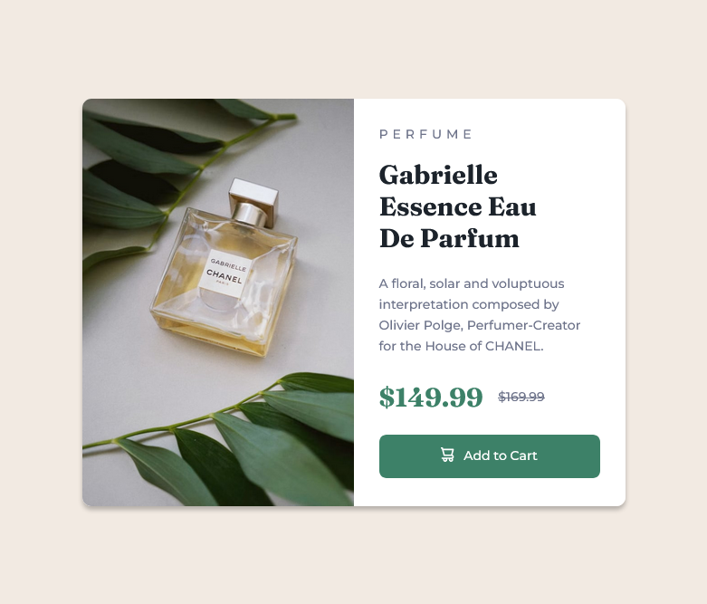
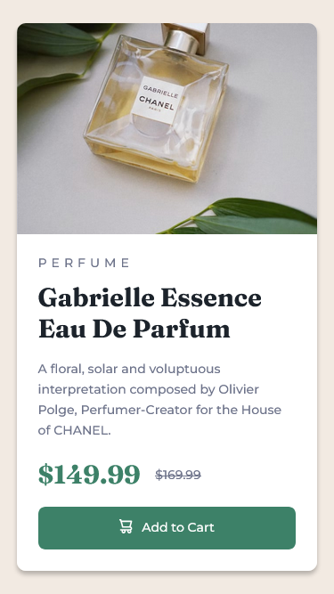
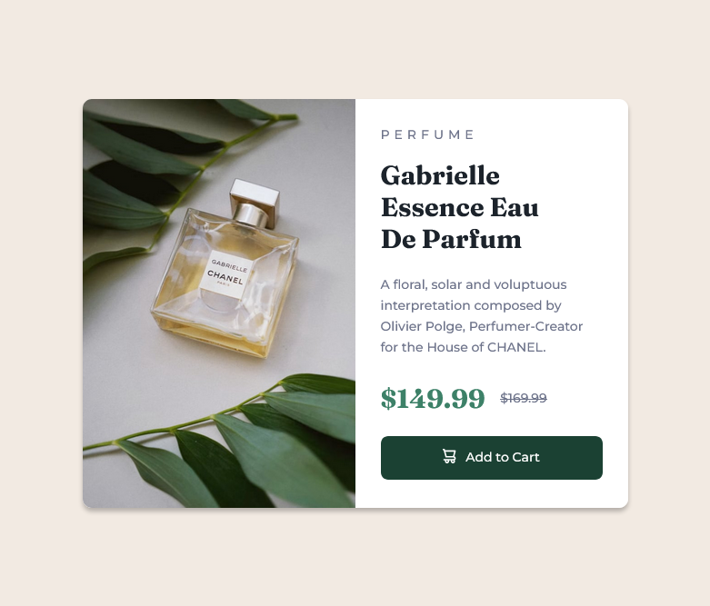

# Mobile First Responsive Product preview card component

## Table of contents

-   [Overview](#overview)
    -   [The challenge](#the-challenge)
    -   [Screenshots](#screenshots)
    -   [Links](#links)
-   [My process](#my-process)
    -   [Built with](#built-with)
    -   [What I learned](#what-i-learned)
    -   [Continued development](#continued-development)
    -   [Useful resources](#useful-resources)
-   [Author](#author)
-   [Acknowledgments](#acknowledgments)

## Overview

### The challenge

I created this product card to practice my understanding of Flex-box, Sass, BEM and Mobile-First Workflow.

Users should be able to:

-   View the optimal layout depending on their device's screen size
-   See hover and focus states for interactive elements

### Screenshots





### Links

-   Solution URL: [Github](https://github.com/NicholasAnich/Product-Preview-Card-Component)
-   Live Site URL: [Netlify Page](https://thriving-empanada-69c027.netlify.app/)

## My process

### Built with

-   Semantic HTML5 markup
-   CSS custom properties
-   Flexbox
-   Mobile-first workflow

### What I learned

I learnt about the picture html tag where you can provide mulitple source elements with images. The broswer will look at each source element and choose the best suited image, usually by the media attribute where you can specify a breakpoint.

```html
<section class="pictures">
    <picture class="pictures__img">
        <source
            srcset="./images/image-product-desktop.jpg"
            media="(min-width:41.875em)"
            alt="A bottle of Gabrielle Essence Eau De Parfum lying on a white table next to two branches with dark green leaves"
        />
        
    </picture>
</section>
```

### Continued development

I want to fix up all accessibility concerns for this in the future as well as easing the transistions between mobile and desktop break points.
Also would love to clean up any unecessary css.

### Useful resources

-   [CSS-tricks: A guide to flexbox](https://www.example.com) - This allowed me to reference properties and methods of flexbox.
-   [ARIA Roles - button](https://developer.mozilla.org/en-US/docs/Web/Accessibility/ARIA/Roles/button_role) - Accessibility for buttons

**Note: Delete this note and replace the list above with resources that helped you during the challenge. These could come in handy for anyone viewing your solution or for yourself when you look back on this project in the future.**

## Author

-   Website - [Nicholas Anich](https://www.your-site.com)
-   Frontend Mentor - [@NicholasAnich](https://www.frontendmentor.io/profile/yourusername)
-   GitHub - [@NicholasAnich](https://github.com/NicholasAnich)

## Acknowledgments

This is a solution to the [Product preview card component challenge on Frontend Mentor](https://www.frontendmentor.io/challenges/product-preview-card-component-GO7UmttRfa). Frontend Mentor challenges help you improve your coding skills by building realistic projects.
